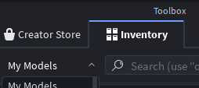

# <span></span> Azul Companion Plugin

## Installation

### Method 1: Auto-Install (Recommended)

1. Install the plugin automatically using the Roblox Plugin Marketplace: https://create.roblox.com/store/asset/79510309341601/Azul-Companion-Plugin

If the plugin does not show up, follow the [troubleshooting](#troubleshooting) steps below.

> [!WARNING]
> The manual methods don't receive automatic updates. You will need to repeat your preferred manual installation steps to update the plugin.

### Method 2: Manual Install via Place File

1. Download the source code from the [Azul Companion Plugin](https://www.roblox.com/games/132762411481199/Azul-Companion-Plugin) place: (3 dots -> "Download")
2. Open the downloaded `.rbxlx` or `.rbxl` file in Roblox Studio
3. Right-click the `AzulPlugin` folder in `ServerStorage` and select **"Save as Local Plugin"**
4. Restart Roblox Studio
5. The Azul icon should now appear in the toolbar

### Method 3: Manual Install via Azul

Yes, you can build the plugin using Azul itself. That said, it requires you already have the plugin installed.

1. Clone the contents of `/plugin` into a folder structure like `/sync/ServerStorage/AzulPlugin`
2. Run the `azul build` command to sync the files to your Studio's ServerStorage.
3. Right-click the `AzulPlugin` folder in `ServerStorage` and select **"Save as Local Plugin"**
4. The Azul icon should now appear in the toolbar

## Troubleshooting

### Plugin not showing up

Roblox is very particular about how plugins are installed. Sometimes, just "getting" the plugin from the marketplace isn't enough. Try the following steps:

1. Close Roblox Studio completely
2. Reopen Roblox Studio
3. Open any place (or create a new one)
4. Go to **Toolbox** > **Inventory**

   

5. In the dropdown, select **My Plugins**
6. Locate the Azul Companion Plugin and click **Install**
7. The Azul icon should now appear in the toolbar

### Plugin not connecting

- Ensure the daemon is running (run `azul`)
- Check that `HttpService` is enabled:
  - Go to **Home** → **Game Settings** → **Security**
  - Enable **"Allow HTTP Requests"**
- Verify firewall isn't blocking port 8080

### Scripts not syncing

- Click "Toggle Sync" to reconnect
- Check the Output window for error messages
- Restart both the daemon and Studio

### Clearing GUIDs

In the rare case where you're getting GUID conflicts, or simply don't wish to keep existing GUIDs, you can clear all `AzulSyncGUID` attributes by running the following code in the Command Bar:

```lua
-- Run this in the Command Bar
for _, desc in ipairs(game:GetDescendants()) do
    if desc:GetAttribute("AzulSyncGUID") then
        desc:SetAttribute("AzulSyncGUID", nil)
    end
end
```
